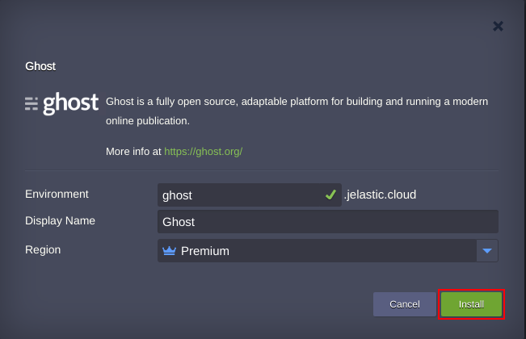
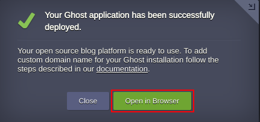

 

# Ghost is a professional publishing platform

Import the required manifest using the link from GitHub:
[https://github.com/vlobzakov/ghost/blob/master/manifest.jps](https://github.com/vlobzakov/ghost/blob/master/manifest.jps)

 

In the installation wizard, if required, change settings such as *Environment Name* or *Region*. Then press __Install__ .

After the completion press __Open in Browser__ button. 

 

## Deploy Now

Press __Deploy__ to get an account and deploy to a certified Jelastic partner from the distributed network of independent data center service providers. 

 
